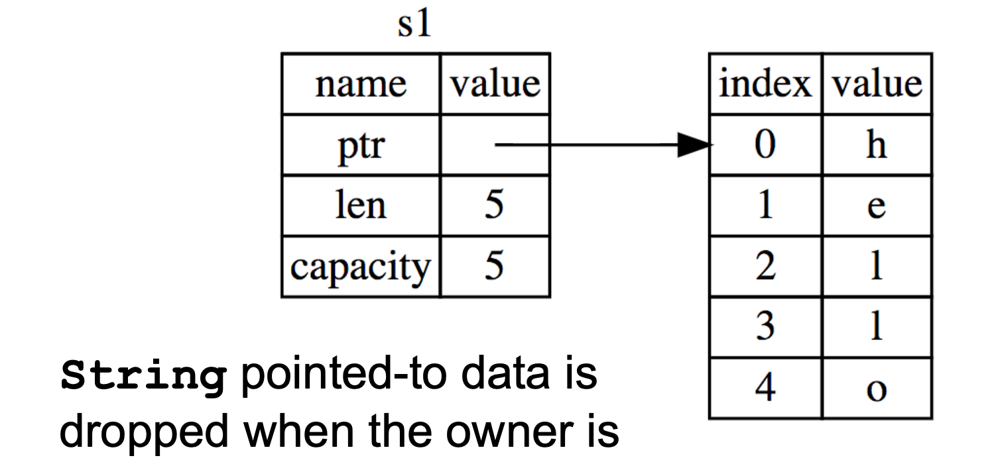
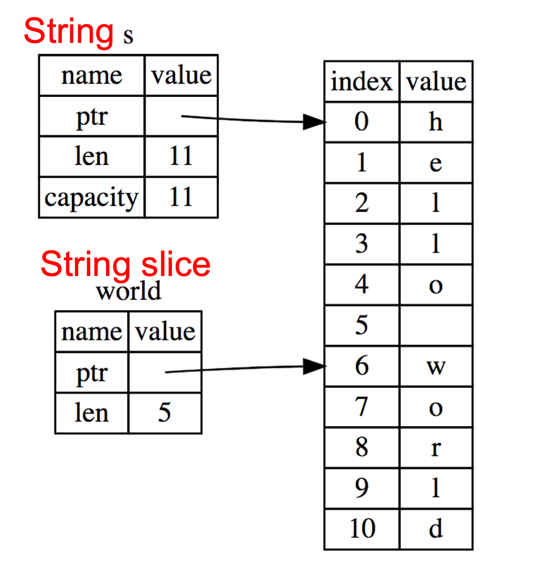

# Rust Notes 

## Rust Intro 
- Type Safe, Thread Safe and fast language 
- Key Features of Rust
    - Lifetimes and ownership 
        -  Ensures safety 
    - Traits as core of object(-like) system 
    - Variable default is **immutability**
    - Data types and pattern matching 
    - Type inference 
        - No need to write types for local variables 
    - Generics (parametric polymorphism) 
    - First-class functions 
    - Efficient C bindings
- Rust programs are compiled using rustc 
    - Source files end in suffix .rs 
    - Compilation, by default, produces an executable 
    - No -c option 
- Preferred: Use the **cargo** package manager 
    - Will invoke rustc as needed to build files 
    - Will download and build dependencies 
    - Based on a .toml file and .lock file 
        - Don’t need to really worry about these 
    - Like ocamlbuild or dune 
- Rust **does not have** a top-level like OCaml 

## Rust Basics 
- Functions
    ```rust
    // comment
    fn main() { 
        println!("Hello, world!");
    }

    // The above prints:
    Hello, world!
    ```

- Let Statements 
    - Redefining a variable shadows it like OCaml 
    ```rust 
    {
        let x = 37;
        let y = x + 5;
        y
    } // 42
    ```
    - Variables are immutable by defualt; use mut to allow updates 
    ```rust
    {
        let x = 37; 
        x = x + 5; //error
        x
    }
    // instead of the above do: 
    { 
        let mut x = 37;
        x = x + 5;
        x 
    } // 42
    ```
    - Types are inferred by default; optional annotations must be consistent (may override defaults)

- Conditionals
    ```rust 
    fn main() {
       let n = 5;
       if n < 0 {
         print!("{} is negative", n);
       } else if n > 0 {
         print!("{} is positive", n);
       } else {
         print!("{} is zero", n);
       }
    }

    // This will print:
    5 is positive
    ```
- Conditionals are *Expressions* (like OCaml)
    Below is an example of a type error because the conditonal returns soemthing of type int and string (depending on if the condition is true of false) which is not allowed. Notice the "a" and the 10
    ```rust 
    fn main() {
       let n = 5;
       let x = if n < 0 {
        10 // int
        } else {
            "a" // string -> notice int and string cause type error
        };
        print!("{:?}|",x);
        }
    ```

- Example: Factorial in Rust (Recursively)
    ```rust 
    fn fact(n:i32) -> i32 {
        if n == else {
        let x
        n*x 
        }
    }
    fn main() {
        let res = fact(6); println!(“fact(6) = {}”,res);
    }

    fact(6) = 720
    ```
- Another example of a type error: 
    ```rust 
    { 
        let x = 6;
        let y = "hi";
        if x == 5 { y } else { 5 }; // notice that if and else have different types
        7
    }
    ```

- Example of violating immutability: 
    ```rust 
    { 
        let x = 6;
        let y = 4;
        y = x;
        x == y
    }
    ```

- Mutation is useful when performing iteration (as in C and Java)
    - Example: 
    ```rust 
    fn fact(n: u32) -> u32 { let mut x = n;
        let mut a = 1;
        loop {
            if x <= 1 { break; } // infinite loop (break out)
            a = a * x;
            x = x - 1;
        }
        a
    }
    ```
- Other looping constructs 
    - **While** loops 
        - while ```e``` block 
    - **For** loops 
        - for ```pat``` in ```e``` block 
        - Example:  
        ```rust 
        for x in 0..10 {
            println!("{}", x); // x: i32
        }
        ```
    - These (and ```loop```) are *expressions* 
    - They return the final computed value 
        - unit, if none 
    - ```break``` may take an expression, which is the loop's final value
    ```rust 
    let mut x = 5;
    let y = loop {
        x += x - 3;
        println!("{}", x); // 7 11 19 35
        x % 5 == 0 { break x; }
    };
    print!("{}",y); //35
    ```

## Data 
- Scalar Types: 
    - Integers 
        - i8, i16, i32, i64, isize 
            - **i32 default**
        - u8, u16, u32, u64, usize
    - Characters (unicode)
        - char
    - Booleans 
        - bool = {true, false}
    - Floating Point Numbers 
        - f32, f64
            - **f64 default**
    - Note: arithmetic operators (+, -, etc.) **overloaded**

- Compound Data: 
    - Tuples 
        - n-typle type (t1, ..., tn)
            - unit() is just the 0-tuple
        - n-tuple expression(e1,...,en)
        - Accessed by pattern matching or like a record field
        ```rust
        let tuple = ("hello", 5, 'c');
        assert_eq!(tuple.0, "hello");
        let(x,y,z) = tuple;
        ```
        - Another Example: Distance between two points s and e: 
        ```rust 
        fn dist(s:(f64,f64),e:(f64,f64)) -> f64 { 
            let (sx,sy) = s;
            let ex = e.0;
            let ey = e.1;
            let dx = ex - sx;
            let dy = ey - sy; 
            (dx*dx + dy*dy).sqrt()
        }
        ```
        - Carrying over from the previous example, it is important to note that we can include patterns in parameters directly, too. For example: 
        ```rust
        fn dist2((sx,sy):(f64,f64),(ex,ey):(f64,f64)) -> f64 { 
            let dx = ex - sx;
            let dy = ey - sy;
            (dx*dx + dy*dy).sqrt()
        }
        ```
        - Rust structs generalize tuples. 

## Arrays 
- Standard Operations 
    - Creating an array (can be mutable or not) 
        - But must be of fixed length 
    - Indexing an array (arrays are 0-indexed)
    - Assigning at an array index 
    - Example: 
    ```rust 
    let nums = [1,2,3]; // type is [i32;3]
    let strs = ["Monday","Tuesday","Wednesday"]; //[&str;3] 
    let x = nums[0]; // 1
    let s = strs[1]; // "Tuesday"
    let mut xs = [1,2,3];
    xs[0] = 1; // OK, since xs mutable
    let i = 4;
    let y = nums[i]; //fails (panics) at run-time as i is out of bounds? 
    ```

- Iteratin 
    - Rust provides a way to iterate over a collectio 
        - Including arrays 
        ```rust 
        let a = [10,20,30,40,50];
        for element in a.iter() {
            println!("the value is: {}", element);
        }
        ```
        - a.iter() produces an iterator, like a Java iterator 
            - This is a **method call**. More about these comes later 
        - The special ```for``` syntax issues the ```.next()``` call until no elemenents are left
            - This makes sure there is no possibility of running out of bounds 
    - Example: This function will not type check because we don't know the array length. We need to have an array length  
    ```rust 
    fn f(n:[u32]) -> u32 {
        n[0]
    }
    ```
    - This one will type check (same as above, except has length): 
    ```rust 
    fn f(n:[u32;4]) -> u32 {
        n[0]
    }
    ```

## Testing 
- In any language, there is the need to test code
- In most languages, testing requires extra libraries: 
    - Ounit in OCaml 
    - Junit in Java 
- Testing in **Rust** is a first-class citizen! What does this mean? 
    - It means that the **testing framework** is built into **cargo**

####  Unit Testing in Rust
- Unit testing is for local or private functions 
    - put such tests in the **same file** as your code
- Use ```assert!``` to test that something is true 
- Use ```assert_eq!``` to test that two things that implement the ```PartialEq``` trait are equal 
    - Ex: integers, booleans, etc.
    - More on traits in a later section! 
- Note the following about this code: 
    ```rust 
    fn bad_add(a: i32, b: i32) -> i32 {
        a-b 
    }

    #[cfg(test)] // this indicates that this module contains tests
    mod tests { // mod indicates that this is a module named tests
        #[test] // indicates the following function is a test
        fn test_bad_add() {
            assert_eq!(bad_add(1,2),3);
        } 
    }
    ```

#### Integration Testing in Rust 
- Integration testing is for APIs and whole programs 
- Create a ```tests``` directory 
- Create different files for testing major functionality 
- Files don't need ```#[cfg(test)]``` or a special module 
    - But they still do need ```#[test]``` around each function 
- Tests refer to code as if it were using an external library 
    - Declare it as an external library using ```extern crate```
    - Indclue the functionality you want to test with ```use```
- Example: 
    - src/lib.rs
    ```rust 
    pub fn add(a: i32, b: i32) -> i32 { 
        a+b
    }
    ```
    - tests/test_add.rs 
    ```rust 
    extern crate my-project-name; 
    use my-project-name::add; 
    #[test]
    pub fn test_add() {
        assert_eq!(add(1,2), 3));
    }
    #[test]
        pub fn test_negative_add() { assert_eq!(add(1,-2), -1));
    }
    ```

#### Running Tests 
- ```cargo test``` runs all your tests 
- ```cargo test s``` runs all tests that contain ```s``` in the name 
- By default, console output is hidden 
    - Use ```cargo test -- --nocapture``` to unhide it


## Ownership 

### Rust: GC-less Memory Management, Safely
- Rust’s heap memory managed without Garbage Collection. 
- Type checking ensures no dangling pointers or buffer overflows. Type checker disallows unsafe idioms.

- Ownership and lifetimes are the key features that ensure safety. In Rust, data has a single owner. Immutable aliases OK, but mutation only via owner or single mutable reference. 
- How long data is alive is determined by a lifetime

#### Memory: the Stack and the Heap
* The stack
  * constant-time, automatic (de)allocation
  * Data size and lifetime must be known at compile-time. Function parameters and locals of known (constant) size

* The heap
  * Dynamically sized data, with non-fixed lifetime. Slightly slower to access than stack; i.e., via a pointer
* GC: automatic deallocation, adds space/time overhead
* Manual deallocation (C/C++): low overhead, but non-trivial opportunity for devastating bugs: Dangling pointers, double free – instances of memory corruption

### Rust Ownership
* Each value in Rust has a variable that’s its owner
* There can only be one owner at a time
* When the owner goes out of scope, the value will be dropped (freed)
```rust
{ 
  let mut s = String::from("hello"); //s is the owner
  s.push_str(", world!"); 
  println!("{}", s);
} //s’s data is freed by calling s.drop()

```
#### Assignment Transfers Ownership
By default, an assignment moves data
```rust
let x = String::from("hello");
let y = x; //x moved to y
```
A move leaves only one owner: y
```rust
println!("{}, world!", y); //ok
println!("{}, world!", x); //fails
```
`Move` prevents double free, or use-after-free because everything has a single owner that that owner cleans the memory it is pointing to.

Primitives (i32, char, bool, f32, tuples of these types, etc.) do not transfer ownership on assignment. They derive the `Copy` trait. Therefore, an assignment copies the entire object. 
```rust
let x = 5;
let y = x;
println!("{} = 5!", y); //ok
println!("{} = 5!", x); //ok
```
#### Traits 
- A Trait is a way of saying that a type has a particular property
    - ```Copy```: objects with this trait do not transfer ownership on assignment 
        - instead, assignment copies all of the object data 

- Another way of using traits: to indicate functions that a type is must implement (more in a later section)
    - Like Java interfaces 
    - Example: ```Deref``` built-in trait indicates than an object can be dereferenced via * op; compiler calls object's ```deref()``` method

#### Cloning
To avoid the loss of ownership, objects may be explicitly cloned. But at the cost of a copy.
```rust
let x = String::from("hello");
let y = x.clone(); //x ownership not moved
println!("{}, world!", y); //ok
println!("{}, world!", x); //ok
```

Ownership transfers in function calls. On a call, ownership passes from the argument to called function’s parameter and returned value to caller’s receiver. 
```rust
fn main() {
  let s1 = String::from(“hello”);
  let s2 = id(s1);   //s1 moved to arg
  println!(“{}”,s2); //id’s result moved to s2
  println!(“{}”,s1); //fails
}

fn id(s:String) -> String {
 s // s moved to caller, on return
}
```
#### References and Borrowing
- Borrowing creates an alias by making a reference. It is an explicit, non-owning pointer to the original value. 
- Is it done with `&` operator. References are immutable by default (can override). 
- Borrowing shares read-only access through owner and borrowed references.
- Mutation disallowed on original value until borrowed reference(s) dropped. 

```rust
fn main() {
 let s1 = String::from(“hello”);
 let len = calc_len(&s1); //lends reference
 println!(“the length of ‘{}’ is {}”,s1,len);
}
fn calc_len(s: &String) -> usize {
 s.push_str(“hi”); //fails! refs are immutable
 s.len()    // s dropped; but not its referent
}
```

#### Rules of References
* At any given time, you can have either but not both of
  * One mutable reference
  * Any number of immutable references
* References must always be valid (pointed-to value not dropped)

#### Mutable references
To permit mutation via a reference, use `&mut`, instead of just `&`. But only works for mutable variables. 
```rust
let mut s1 = String::from(“hello”);
{ 
  let s2 = &s1;
  s2.push_str(“ there”);//disallowed; s2 immutable
} //s2 dropped
let s3 = &mut s1; //ok since s1 mutable
s3.push_str(“ there”); //ok since s3 mutable
println!(”String is {}”,s3); //ok
```
At any moment, we can make only one mutable reference. Doing so blocks use of the original owner, which is restored when reference is dropped. 
```rust
let mut s1 = String::from(“hello”);
{ 
  let s2 = &mut s1; //ok
  let s3 = &mut s1; //fails: second borrow
  s1.push_str(“ there”); //fails: second borrow
} //s2 dropped; s1 is first-class owner again
s1.push_str(“ there”); //ok
println!(”String is {}”,s1); //ok
```
**BUT**
Rust has been updated to support lifetimes that end before the surrounding scope. Please read the [this blog](http://blog.pnkfx.org/blog/2019/06/26/breaking-news-non-lexical-lifetimes-arrives-for-everyone/) for details. 
```rust
let mut s1 = String::from(“hello”);
{ let s2 = &mut s1; //ignored – never used
  let s3 = &mut s1; //ignored – never used
  s1.push_str(“ there”); //OK!
  s2.push_str(“ there”); //fails – 2 mutable refs
} //s2 dropped; s1 is first-class owner again
s1.push_str(“ there”); //ok
println!(”String is {}”,s1); //ok
```

We cannot make a mutable reference if immutable references exist because the holders of an immutable reference assume the object will not change!
```rust
let mut s1 = String::from(“hello”);
{ 
  let s2 = &s1; //ok: s2 is immutable
  let s3 = &s1; //ok: multiple imm. refs allowed
  let s4 = &mut s1; //fails: imm ref already
} //s2-s4 dropped; s1 is owner again
s1.push_str(“ there”); //ok
println!(”String is {}”,s1); //ok
```

Another example to showcase Mutable References effectively: (**From Cliff's Notes**)
```rust
let mut x = String::from("Hello");
x.push_str(" World"); // concats " World" to "Hello"
{
    let y = &x;
    println!("{} and {} can only read, no write",x,y);
};
x.push_str("!");
println!("{} is still valid",x);
 ```

- At line 1: ’x’ is the mutable owner of the "Hello" value so it can read and write to "Hello".     
- We can see it write in line 2 with the push_str function. 
- Then at line 4, an immutable reference is created, which makes us take a look at rule 2: 
    - We cannot have both one immutable and one mutable reference to a value so what happens? 
    - In this case, Rust makes the ’x’ mutable reference immutable (revokes write access) for the entire duration of ’y’s lifetime (not scope!). This means, we cannot mutate the now "Hello World" string until ’y’s lifetime ends (at line 5). Afterwards, ’x’ gains write access again and is allowed to mutate "Hello World" to "Hello World!" in line 7.
- The purpose behind this rule is to prevent dangling pointers, and also prevent data races. Data races are a good place for undesired behaviour to occur, and temporal attacks, while difficult to pull off, can be devastating. To mitagate data races, the rules of references come into play. Let us rephrase rule 2 into read and write access terms:
    - You can have many readers to a piece of data and no writers XOR
    -  You can have 1 writer and no readers to a piece of data at a time.


#### The * Operator 
Given a value of type ```T&```(or ```T&mut```), use the * operator to read or write its underlying contents: 
```rust
let mut x = 2; // x is a mutable variable, allowing x to be reassigned
let mut y = 3; // y is a mutable variable, allowing y to be reassigned
let mut r = &mut x; 
*r = 4;
r = &mut y;
*r = 5;
```
- Note that two uses of ```mut``` for ```r``` above have different meanings 
    - first mut makes r itself a mutable variable, meaning that the reference held by r can be changed to point to a different variable
    - the second mut in &mut x specifies that r is a mutable reference to x. This means r not only points to x, but it also allows x to be modified through the reference. So, when you do *r = 4, you are actually changing the value of x to 4.
    - Therefore, the first use of mut (in let mut x and let mut y) pertains to the mutability of the variables themselves, allowing their values to be changed. The second usage of mut (in let mut r = &mut x) relates to the mutability of the reference and what it points to, allowing both the target of the reference and the reference itself to be mutable.


#### Aside: Generics and Polymorphism 
- Rust has support like that of Java and OCaml
    - Ex: The ```std``` library defines ```Vec<T>``` where ```T``` can be **instantiated** with a variety of types. 
        - ```Vec<char>``` is a vector of characters
        - ```Vec<&str>``` is a vector of string slices 
- You can define polymorphic functiosn as well: 
    - Rust: ``` fn id<T>(x:T) -> T { x } ```
    - Java: ``` static<T> T id(T x) { return x; }```
    - Ocaml: ``` let id x = x```


## Lifetimes 

#### Lifetimes: Avoiding Dangling References
- References must always be to valid memory. 
- They must not point to a memory that has been dropped.
- Rust will disallow this using a concept called `lifetimes`. 
- A lifetime is a type-level parameter that names the scope in which the data is valid.

```rust
fn main() {
  let ref_invalid = dangle();
  println!(“what will happen … {}”,ref_invalid);
}
fn dangle() -> &String { 
  let s1 = String::from(“hello”);
  &s1
} // bad! s1’s value has been dropped
```
Lifetime corresponds with scope
```rust
{
  let r = 5;
  {
    let x = &r;
    println!(“r: {}”,r); //ok.  r has a longer lifetime than x.
  }
}
```
- Variable x in scope while r is. 
- A lifetime is a type variable that identifies a scope
- r’s lifetime ‘a exceeds x’s lifetime ‘b. ('b <= 'a)

Lifetime prevents Dangling References. In this example, Variable x goes out of scope while r still exists. r’s lifetime ‘a exceeds x’s lifetime ‘b so not safe to assign x to r.

```rust
{
  let r; // deferred init
  {
    let x = 5;
    r = &x;
  }
  println!(“r: {}”,r); //fails. 
}
```

#### Examples: 
```rust
fn main() {
    let s1 = String::from("hello");
    let len = calc_len(&s1); //lends pointer
    println!("the length of ‘{}’ is {}",s1,len);


    { let mut s1 = String::from("hello");
        { let s2 = &s1;
            println!("String is {} and {}",s1,s2); //ok
            s1.push_str(" world!"); //disallowed
        } //drops s2
        s1.push_str(" world!"); //ok
        println!("String is {}",s1);}//prints updated s1


}
fn calc_len(s: &String) -> usize {
    s.push_str("hi"); //fails! refs are immutable
    s.len()    // s dropped; but not its referent
}
```

```rust
fn main() {
    let mut s = String::from("Hello");
    {
        let s2 = &s;
    } //s2 drops here
    s.push_str("world"); //if s2 exits, can't modify 
    println!("{}",s);
}
```

```rust
fn main() {
  let ref_invalid = dangle();
  println!("what will happen … {}",ref_invalid);
}
fn dangle() -> &String { 
  let s1 = String::from("hello");
  &s1
} // bad! s1’s value has been dropped
```

Factorial (with mutable variables)
```rust
fn fact(n: u32) -> u32 {
  let mut x = n;
  let mut a = 1;
  //loop : infinite loop, has to break
  loop {
    if x <= 1 { break; }
    a = a * x;
    x = x - 1;
  }
  a
}

fn fact2(n: u32) -> u32 {
  let mut a = 1;
  for i in 1..(n+1) {
    a = a * i;
  }
  a
}
fn main(){
  let f = fact2(5);
  println!("5!={}",f);

}
```
Factorial (recursive)
```rust
fn fact(n:i32) -> i32
{
  if n == 0 { 1 }
  else {
    let x = fact(n-1);
    n * x
  }
}

fn main(){
  let f = fact(5);
  println!("5!={}",f);

}
```


```rust
fn main(){
   let mut s1 = String::from("hello");
   {
	  let s2 = &s1; //ok: s2 is immutable
    //let s3 = &s1; //ok: multiple imm. refs allowed
    // let s4 = &mut s1; //fails: imm ref already
    // s1.push_str(" there"); //ok
   } //s2-s4 dropped; s1 is owner again
 
   println!("String is {}",s1); //ok
 }
```

```rust
fn main(){
   let s = String::from("hello");
   {
	  let s1 = s;
	  println!("{}",s1);
	  //println!("{}",s); // this does not work because s is moved to s1
   }

   //println!("{}",s);	//this does not work, because s1 is dropped and ownership is not returned to s.

   let x = String::from("hello");
   let y = x; //x moved to y

   println!("{}, world!", y); //ok
   println!("{}, world!", x); //fails

   //clone

   let x = String::from("hello");
   let y = x.clone(); //x no longer moved
   println!("{}, world!", y); //ok
   println!("{}, world!", x); //ok

   //Primitives copied automatically
   let x = 5;
   let y = x;
   println!("{} = 5!", y); //ok
   println!("{} = 5!", x); //ok
}
```


#### Lifetimes and Functions: 
- Lifetime of a reference not always explicit 
    - Ex: when passed as an argument to a function
    ```rust
    fn longest(x:&str, y:&str) -> &str { // the last &str is a String slice 
        if x.len() > y.len() { x } else { y }
    }
    ```
- What could go wrong here? 
    ```rust
    { let x = String::from(“hi”); 
    let z;
        { let y = String::from(“there”); 
        z = longest(&x,&y);     //will be &y
    }   //drop y, and thereby z
    println!(“z = {}”,z);   //yikes! }
    ```

#### Lifetime Parameters
- Each reference to a value of type ```t``` has a **lifetime parameter**
    - ```&t``` (and ```&mut t```) - lifetime is implicit 
    - ```&'a t``` (and ``` &'a mut t```)- lifetime 'a is explicit 
- Where do the lifetime names come from? 
    - When left implicit, they are generated by the compiler
    - Gloval variables have lifetime ```'static ```
- Lifetimes can also be **generic** 
    ```rust 
    fn longest<‘a>(x:&‘a str, y:&‘a str) -> &‘a str { 
        if x.len() > y.len() { x } else { y }
    }
    ```
    - Thus, ```x``` and ```y``` must have the same lifetime, and the returned reference shares it

#### Lifetimes FAQ 
- When do we use **explicit lifetimes**?
    - When more than one var/type needs the same lifetime (like the ```longest``` function)

- How do I tell the compiler exactly which lines of code lifetime ```'a``` covers?
    - You can't. The compiler will always figure it out. 

- How does lifetime subsumption work? 
    - If lifetime ```'a``` is longer than ```'b```, we can use ```'a``` where ```'b``` is expected; can require this with ```'b: 'a```
        - Permits us to call ```longest(&x, &y)``` when ```x``` and ```y``` have different lifetimes, but one outlives the other.
    - Just like subtyping/subsumption in OO programming! 

- Can we use lifetimes in data definitions? 
    - Yes; we will see this in ```structs, enums```, etc. 

#### QUICK RECAP NOTES: 
References must always be valid means that a reference must never outlive its referent. 


At any given time, you can have either but not both of:
- One mutable reference 
- Any number of immutable references


## Collections 

#### String Represntation

- Rust's ```String``` is a 3-tuple
    - A pointer to a **byte array** (interpreted as UTF-8)
    - A (current) **length**
    - A (maximum) **capacity**                          
        - Always: length <= capacity
    -  
    ```rust
    let mut s = String::new(); 
    println!("{}", s.capacity()); 
    for _ in 0..5 {
        s.push_str("hello"); 
        println!("{},{}",
            s.len(),s.capacity()); 
    }
    ```
    - above code prints (on separate lines) 
        - 0
        - 5,5 
        - 10, 10
        - 15, 20
        - 20, 20
        - 25, 40

#### UTF-8 and Rust Strings 
- UTF-8 is a **variable length** character encoding 
    - The first 128 characters (US-ASCII) need one byte
    - The next 1,920 chatacters need two bytes, which covers the remainder of almost all Latin-script alphabets,... upto 4 bytes
- You may **NOT**** index a string directly; Rust will stop you 
    - You could end up in the middle of a character! 
    ```rust 
    let s1 = String::from("hello");
    let h = s1[0]; // rejected 
    ```

### Slices

#### Shared Data, Separate Metadata 
- What we want is to have both strings share the same underlying data 
- Happily, Rust's containers permit a way to reference a portion of an object's contents. 
    - These are called **slices**
-   

#### String Slices in Rust 
- If ```s``` is a ```String```, then ```&s```[range] is a string slice, where *range* can be as follows 
    - i..j is the range from i to j, inclusive 
    - i.. is the range from i to the current length 
    - ..j is the range from 0 to j
    - .. i sthe range from 0 to the current length 
- &str is the type of a ```String``` slice 

- Example: 
    - Here's ```first_word``` in Rust, using slices: 
    ```rust 
    pub fn first_word (s: &String) -> &str { 
        for (i, item) in s.char_indices() {
            if item == ' ' { 
                return &s[0..i];
            } 
        }
        s.as_str() 
    }
    // Loop through each character and its index in the string: for (i, item) in s.char_indices() iterates over the string s, providing a tuple where i is the index of the character in the string and item is the character at that index.

    // Check for a space character: The condition if item == ' ' checks if the character is a space (' ').

    // Return the substring up to the space: If a space is found, return &s[0..i]; returns a slice of the string from the start up to (but not including) the index of the space. This effectively slices the string at the first space, assuming that the first word ends where the space begins.

    // Return the whole string if no space is found: If the loop completes without finding any space (i.e., no space character is in the string), s.as_str() is called. This method returns the entire string as a slice is there are no spaces. 
    ```
    - If we used ```s.as_bytes()``` we could end up examining one byte of a multi-byte character, due to the UTF-8 encoding

#### String Slices and Ownership
- A ```&str``` slice borrows from the original string 
    - just like an immutable ```String``` reference
    - this prevents dangling pointers 
    ```rust
    let mut s = String::from("hello world"); 
    let word = first_word(&s); //borrow 
    s.clear(); // Error! Can’t take mut ref
    ```
#### String Slices are (should be) the Default!
- String literals are slices
    ```rust 
    let s:&str = "hello world";
    ```
    - Variable ```s``` is *not* the owner of this string data 
        - the compiler establishes a static owner to permit free immutable sharing 
    - Strings *do* own their data; useful if you want to modify it

- Should use slices where possible
    - Ex: earlier example ```fn first_word(s:&str) -> &str```
        - Can convert ```String s``` to a slice via `&s[..]`. Oftentimes, this coercion is done automatically (due to the `Deref` trait)

- Interesting Example: 
    ```rust
    let s1 = String::from(”CMSC");
        let s3; //deferred init
        {
            let s2 = String::from(”330");
            s3 = s1+&s2; 
        }
        print!("{}",s3);
        print!("{}",s1);
    ```
    **Step by step breakdown of above example:**
    - Initialization of s1: The string "CMSC" is created and its ownership is assigned to s1.
     
    - Deferred Initialization of s3: s3 is declared but not initialized at this point.

    - Block Scope:
        - Initialization of s2: Inside the block, the string "330" is created and its ownership is assigned to s2.
        - String Concatenation and Ownership Transfer: The expression s1 + &s2 performs string concatenation. Here, s1 is moved into the concatenation operation and cannot be used after this point unless it is returned or cloned before moving. The &s2 part is a borrow, so s2 retains its ownership. The result of s1 + &s2 is a new String that now owns the concatenated result, which is assigned to s3.
        - End of s2's Scope: When the block ends, s2 goes out of scope and its memory is deallocated. However, because s2 was only borrowed (not moved) during the concatenation, its going out of scope does not affect the validity of s3.
    
    - Print s3: The variable s3 now contains the concatenated string "CMSC330" and is printed.

    - Attempt to Print s1: This will result in a compile-time error because s1 was moved during the concatenation (s1 + &s2) and is no longer valid to use after that point. 
    


### Vectors 

#### Basics
- `Vec<T>` in Rust is `Arraylist<T>` in Java 
    ```rust 
    { 
        let mut v:Vec<i32> = Vec::new(); 
        v.push(1); // adds 1 to v
        v.push(“hi”); //error – v contains i32s
        let w = vec![1, 2, 3]; //vec! is a macro 
    } // v,w and their elements dropped
    ```
- Indexing can fail (panic) or return an `Option`
    ```rust 
    let v = vec![1, 2, 3, 4, 5];
    let third:&i32 = &v[2]; //panics if OOB
    let third:Option<&i32> = v.get(2); //None if OOB
    ```

#### Aside: Options 
- `Option<T>` is an **enumerated type**, like an OCaml variant
    - `Some(v)` and `None` are possible values 
    ```rust
    let v = vec![1, 2, 3, 4, 5];
    let third: Option<&i32> = v.get(2); // v.get(2) returns value at index 2 which in this case is 3
    let z =
        match third {
            Some(i) => Some(i+1), //matches here 
            None => None
        };
    ```

#### Iteration 
- Iterator variable can be mutable or immutable: 
    ```rust
    let mut v = vec![100, 32, 57];
    for i in &v { println!("{}", i); } 
    for i in &mut v { *i += 50; }    
    ```

#### Vectors and Strings 
- Like `Strings`, vectors can have slices 
    ```rust 
    let a = vec![10, 20, 30, 40, 50];
    let b = &a[1..3]; // [20,30]
    let c = &b[1];    // 30
    println!("{}",c); // prints 30
    ```
- `Strings` can be implemented internally as a `Vec<u8>'
    - But: don't mess with the byte-level representation of UTF-8 strings. 


### HashMaps
- `Hashmap<K, V>` has the expected methods (roughly- see manual for gory detals) 
    - `new     :   ()       ->   HashMap<K,V>`
    - `insert  :   (K, V)   ->   Option<V>`
    - `get     :   (&K)     ->   Option<&V>`
- See also
    - `get_mut`, `entry`, and `or_insert`

## Structs and Enums

### Rust Data 
- So far, we've seen the following kinds of data 
    - Scalar types (int, float, char, string, bool)
    - Tuples, Arrays, and Collections

- How can we build other data structures?
    - Structs (like Objects)
    - Enums (like OCaml datatypes)
    - Traits (like Java interfaces)

#### Primitive Data Conversion with `as`
```rust
fn main() {
let decimal = 65.4321_f32; //floating point number
let integer: u8 = decimal; //error: no auto-convert
// Explicit conversion
let integer = decimal as u8; // explicit conversion let character = integer as char; println!("Casting: {} -> {} -> {}",
             decimal, integer, character);
```
- Casting: 65.4321 -> 65 -> A

### Structs 

#### Definitions and Construction
```rust
struct Rectangle {
    width: u32, // Field with unsigned int type
    height: u32,
}
fn main() {
    // construction
    let rect1 = Rectangle { width: 30, height: 50 };

    // accessing fields
    println!("rect1’s width is {}", rect1.width); // field accessing using rect1.width
}
```
- note that rect1's width is 30 

#### Aside: Construction by Method (more later) 
```rust 
struct Rectangle {
  width: u32,
  height: u32,
}
impl Rectangle { // associated methods
    fn new(width: u32, height: u32) -> Rectangle { 
        return Rectangle{width,height}; //name match
    } 
}
fn main() {
    let rect1 = Rectangle::new(30,50);
    println!("rect1’s width is {}", rect1.width); 
}
```

#### Printing Structs 
- the below code does not work for printing: 
    ```rust 
    struct Rectangle{
    width:u32,
    height:u32,
    }
    fn main() {
        let rect1 = Rectangle::new(30,50); 
        println!("rect1 is {}", rect1);
    }
    ```
    - it throws an error: error[E0277]: the trait bound `Rectangle: std::fmt::Display` is not satisfied

- in order to properly print, do: 
    ```rust
    #[derive(Debug)]    //Derive Debug trait to support printing

    struct Rectangle {
        width:u32,
        height:u32,
    }

    fn main() {
        let rect1 = Rectangle::new(30,50); 
        println!("rect1 is {:?}", rect1);  // Use printing format which is {:?}
    }
    ```
    - this will print "rect1 is Rectangle { width: 30, height: 50 }"

#### Note on Mutabiltiy 
- Following is an example of a failed attempt to make a `Point` that is always mutable: 
    ```rust 
    struct MutablePoint { 
        x: mut i32,
        y: mut i32,
    }
    ```
    - You get an error -> error: expected type, found keyword 'mut'

- It is important to remember that mutability is a property of the variable that holds the `MutablePoint`, not a property of the type itself!

### Methods 
#### Methods: Definitions on Structs
```rust 
impl Rectangle {
    fn area(&self) -> u32 { // self argument has type rectangle and self argument is a borrowed REFERENCE to the object 
        self.width * self.height
    }
}
```
- `impl Rectangle` defines an implementation block 
    - `self` arg has type `Rectangle` (or reference thereto)
    - Ownership rules: 
        - `&self` for read-only borrowed reference (preferred)
        - `&mut self` for read/write borrowed reference (if needed) 
        - `self` for full owenership (least preferred, most powerful)

#### Methods: Calls 
```rust
fn main() {
    let rect1 = Rectangle::new(30,50);
    println!("The area is {} pixels.", rect1.area()); // notice the dot syntax in rect1.area() to call methods of Rectangle
}
```
- If the method had arugments, we would use function call ex: `rect1.area(3)`

#### Methods: Many Args, Associated Methods 
```rust
impl Rectangle {
    fn can_hold(&self, other:&Rectangle) -> bool { // &Rectangle here means a reference to the Rectangle; most flexible
        self.width > other.width && self.height > other.height
    }
    fn square(size:u32) -> Rectangle {
        Rectangle { width: size, height: size }
    } 
}
```
- `square` is called an associated method 
    - no `self` argument
    - operates on  `Rectangles`
    - called with `let sq = Rectangle::square(3);`


### Generic Lifetimes 
```rust
struct ImportantExcerpt<'a> {
  part: &'a str,
}

fn main() {
  let novel = String::from("Generic Lifetime");
  let i = ImportantExcerpt { part: &novel; }
}
```
- When `structs` are defined to hold references, we need to add a **lifetime annotation** on the reference (here **'a**)
- Lifetime is inferred for `i`, by the compiler (no need to fill it in manually); called "elison"

```rust 
struct ImportantExcerpt<‘a> {
  part: &‘a str,
}
impl<‘a> ImportantExcerpt<‘a> { // the <'a> after impl is the parameter for lifetime annotation (would need the 
                                // same for a generic implementention of a generic interface in Java). 
                                // This can often be inferred 
  fn level(&self) -> i32 {
    3
} }
```

### Enums

#### Enums: Like OCaml Datatypes 
```rust 
// definition
enum IpAddr{
  V4(String),
  V6(String),
}
// construction 
let home = IpAddr::V4(String::from("127.0.0.1")); 
let loopback = IpAddr::V6(String::from("::1"));
```

- OCaml Equivalent is as follows: 
```OCaml
(* definition *)
type IpAddr = V4 of string | V6 of string ;;

(* Construction *)
let home = V4 "127.0.01";;
let loopback = V6 "1";;
```

#### Enums with Blocks 
```rust 
enum IpAddr{
  V4(String),
  V6(String),
}

impl IpAddr {
  fn call(&self) {
  // method body would be defined here
  }
}

let m = IpAddr::V6(String::from("::1"));
m.call();
```

#### Enums with Structs 
- Like on OCaml, enums might contain any type, ex: structs, references, etc.
    ```rust 
    struct Ipv4Addr {
    // details elided
    }

    struct Ipv6Addr {
    // details elided
    }

    enumIpAddr{ 
        V4(Ipv4Addr), 
        V6(Ipv6Addr),
    }
    ```

#### The Option Enum: Generic Types 
- Rust example: This option type is defined in standard lib 
    ```rust
    enum Option<T> { Some(T), None, }

    let some_number = Some(5);
    let some_string = Some("a string");
    let absent_number:Option<&Rectangle> = None; // notice instantiation with any type!
    ```
- OCaml comparison: 
    ```OCaml
    type 'a Option = Some of 'a | None ;;

    let some_number = Some 5 ;;
    let some_string = Some "a string" ;; 
    let absent_number : int option = None;;
    ```

### Generics in Structs & Methods 
- Generic T in struct
    ```rust 
    struct Point<T> {
        x: T,
        y: T, 
    }
    ```

- Generic T in methods 
    ```rust 
    impl<T> Point<T> {
        fn x(&self) -> &T {
            &self.x }
    }
    ```

- Instantiate T as i32 
    ```rust 
    fn main() {
        let p = Point { x:5, y:10};
        println!("p.x = {}", p.x());
    }
    ```

### Matching 
```rust
fn plus_one(x:Option<i32>) -> Option<i32> { 
    match x {
    Some(i) => Some(i +1),
    None => None, 
    }
}
```
#### Matching should be exhaustive! 
- This causes an error at compile time due to non-exhaustive patterns: 
    ```rust
    fn plus_one(x:Option<i32>) -> Option<i32> 
        { match x {
            Some(i) => Some(i +1),
            //missing None
        } 
    }
    ```
- Error at compile time! error[E0004]: non-exhaustive patterns: `None` not covered

#### If-let, for non exhaustive matches
```rust 
fn check(x: Option<i32>) { 
    if let Some(42) = x {
        println!("Success!") // only executed if the match suceeds 
    } else {
        println!("Failure!") }
}

fn main() { 
    check(Some(3)) ;;   // prints "Failure!"
    check(Some(42)) ;;  // prints "Success!"
    check(None) ;;      // prints "Failure!"
}
```

### Enums Summary

#### Syntax
- enum T [`<T>`] {C1 [(t1)], ..., Cn [(tn)],}
- the Ci are called constructors
    - Must begin with a capital letter; may include associated data notated with brackets [] to indicate it’s optional

#### Evaluation
- A constructor Ci is a value if it has no assoc. data
    - Ci(vi) is a value if it does
- Accessing a value of type t is by pattern matching 
    - patterns are constructors Ci with data components, if any

#### Type Checking 
- Ci[(vi)] : T[if vi has type ti]


## Traits 
- Traits abstract behavior that types can have in common 
    - Traits are a bit like Java interfaces 
    - But we can implement traits over any type, anywhere in the code, not only at the point we define the type

- Trait bounds can be used to specify when a generic type must implement a trait 
    - Trait bounds are like Java's bounded type parameters

### Defining a Trait
- Here is a trait with a single function in both rust and java
    ```rust 
    Rust:
    pub trait Summarizable {
        fn summary(&self) -> String;
    }
    ```
    ```Java
    Java:
    public interface Summarizable { 
        public String summary(); 
    }
    ```
    - Specify `&self` for "instance methods"
        - Can also specify "associated methods"
            - Like `static` methods in Java 
    - Note the keyword `pub` makes any module, function, or data structure accessible from inside of external modules. The `pub` keyword may also be used in `use` declaration to re-export an identifier from a namespace.
    - Note that we make the entire trait public, not individual elements of it. 

### Implementing a Trait on a Type 
```rust
// name of the trait is "Summarizable" and the type on which we are implementing it is "(i32, i32)"
impl Summarizable for (i32,i32) { 
    fn summary(&self) -> String {
        let &(x,y) = self;
        format!("{}",x+y) 
    }
} 

fn foo() {
    // .summary is the trait method invocation! 
    let y = (1,2).summary(); //”3”
    let z = (1,2,3).summary();//fails 
}
```

### Default Implementation 
- Here is a trait with a default implementation 
```rust
pub trait Summarizable {
    // here we have a default implementation specified inside the summary function 
    fn summary(&self) -> String { 
        String::from(“none”) 
    }
}

impl Summarizable for (i32, i32, i32) {} // The Summarizable trait is implemented for the tuple type (i32, i32, i32). 
                                         // However, this implementation does not provide a custom method for summary, 
                                         // so it will use the default implementation provided by the trait, which returns 
                                         // "none".

fn foo() { 
    let y = (1, 2).summary();       // "3" if using summarizable from previous section, otherwise error
    let z = (1, 2, 3).summary();    // "none"
}
```

### Trait Bounds 
- With generics, you can specify that a type variable must implement a trait 
    ```rust 
    pub fn notify<T: Summarizable>(item: T) { 
        println!("Breaking news! {}",
                    item.summary())
    }
    ```
    - This method works on any type T that implements the Summarizable trait 
        - This is a kind of subtyping: T can have many methods but at the least it should implement those in the Summarizable trait. 
- Equivalent in Java is as follows: 
    ```Java
    <T extends Summarizable> void notify(T item) {
        System.out.println("Breaking news! "+ 
                                item.summary());
    }
    ```
    - This generic method works on any type T that implements the Summarizable interface (which was shown before): 
        ```Java 
        public interface Summarizable { 
            public String summary();
        }
        ```
### Generics, Multiple Bounds 
- Trait implementations can be generic too 
    ```rust 
    pub trait Queue<T> {
     fn enqueue(&mut self, ele: T) -> (); ...
   }

   impl <T> Queue<T> for Vec<T> {
     fn enqueue(&mut self, ele:T) -> () {...} ...
    ```
- Generic method implementations of structs and enums can include trait bounds 
- Can specify multiple Trait Bounds using "+" 
    ```rust 
    fn foo<T:Clone + Summarizable>(...) -> i32 {...} 

    // OR

    fn foo<T>(...) -> i32 where T:Clone + Summarizable {...}
    ```

### (Non) Standard Traits 
- We have seen several standard traits already 
    - Clone holds if the object has a clone() method 
    - Copy holds if assigment duplicates the object 
        - i.e. no ownerhsip transfer, as with primitive types 
    - Deref holds if u can dereference it 
        -i.e., if it's a primitive reference, or has a deref() method
- There are other useful ones too 
    - Display if it can be converted to a string 
    - PartialOrd if it implements a comparison operator 

### Putting all Together 
- Finds the largest element in an array slice 
    - Generic in the type `T` of the contents of the aray 
    ```rust
    fn largest<T: PartialOrd + Copy>(list: &[T]) -> T {
        let mut largest = list[0]; 
        for &item in list.iter() {
            if item > largest { // the > requires PartialOrd trait
                largest = item; // the = requires Copy trait to not transfer owenrship 
            } 
        }
        largest 
    }
    ```
- The following code prints: 
    - The largest number is 100 
    - The larget char is y 

    ```rust
    fn largest<T: PartialOrd + Copy>(list: &[T]) -> T {...}

    fn main() {
        let number_list = vec![34, 50, 25, 100, 65]; 
        let result = largest(&number_list); 
        println!("The largest number is {}", result); 
        let char_list = vec!['y', 'm', 'a', 'q']; 
        let result = largest(&char_list); 
        println!("The largest char is {}", result);
    }
    ```